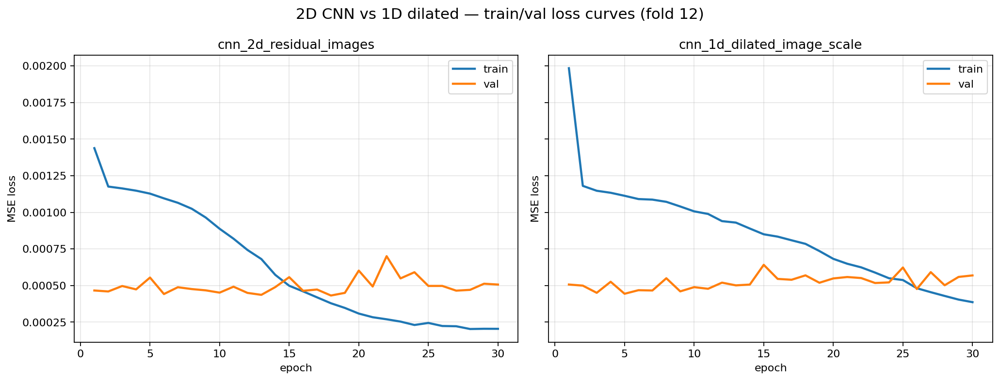

# 주가 차트를 이미지로 바꿔서 CNN에 넣어봤다 — 그런데 베이스라인과 같은 티어였다

> 7개 ETF 자산의 μ 예측에 CNN 7종을 붙였다. 결과를 한 줄로 요약하면: **CNN 단독 성능은 로지스틱 베이스라인과 같은 티어, 하지만 상관이 낮아서 섞었더니 시너지가 나왔다**. 이 글은 "**이겼다/졌다**"가 아니라 "**상관구조를 봐야 보인다**"는 교훈, 그리고 왜 다음 단계로 LSTM이 자연스러운가를 정리한 것.
>
> **최종 결과**: logistic + 1D CNN + 2D CNN (재조정판) 3-family mixed ensemble로 rank corr **0.061**, top-k Sharpe **0.643** 동시 1위.

---

## 1. 시작 — 뭘 만들려고 했나

요즘 한 팀에서 **ODE(미분방정식) 기반 동적 포트폴리오 최적화**를 다루고 있다. 쉽게 말하면:

> "매일매일 시장이 변하는데, 7개 자산(주식·채권·대체투자 등)에 **얼마씩 넣을지를 수식으로 풀어서 정한다**"

이 수식엔 세 가지 입력이 필요하다.

- **μ(mu)**: 각 자산이 앞으로 얼마나 오를지 (기대수익)
- **Σ(sigma)**: 자산들이 같이 움직이는 정도 (공분산)
- **R**: 실제 일별 수익률

Σ·R은 과거 데이터로 기계적으로 나온다. 어려운 건 **μ** — 미래를 맞춰야 하니 완벽은 불가. 다만 **랭킹(어떤 게 더 오를 것 같은지)**만 잘 맞아도 포트폴리오엔 도움이 된다.

나는 이 팀에서 **μ 예측 시그널을 CNN으로 만드는 파트**를 맡았다.

---

## 2. Jiang-style 이미지 변환 — 주가를 그림으로

보통 주가 예측 모델은 숫자 시퀀스를 그대로 넣는다. `[100, 102, 101, 103, ...]` 같은 식.

그런데 2016년 Jiang이라는 연구자가 이런 제안을 했다:

> "**사람 트레이더도 차트를 보고 판단한다**. 그럼 모델도 차트 이미지를 보게 하자"

그래서 60일치 OHLCV(시가·고가·저가·종가·거래량) 데이터를 **정규화된 2D 이미지**로 변환한다. 가로축은 시간, 세로축은 가격 레벨, 픽셀 값은 캔들 모양·거래량 강도 등으로 채운다.

```
숫자 sequence  →  이미지  →  CNN (컴퓨터 비전 모델)  →  μ 예측값
```

CNN은 원래 고양이·강아지 사진 구분용으로 유명한 모델이다. 그걸 주가 차트에 붙이는 게 Jiang-style의 아이디어.

---

## 3. 실험 설계 — CNN 7종 + 로지스틱 베이스라인 2종

"어떤 CNN 구조가 이 문제에 제일 잘 맞을까?"를 보려 7가지 변형을 준비했다. 핵심 설계 결정 하나 — **같은 평가 그리드에 로지스틱 회귀 2종도 올려놨다**. 단순 베이스라인이 얼마나 나오는지 모르면, CNN 내부 순위는 의미가 없다.

| # | 모델 | 입력 | 계열 |
|---|---|---|---|
| 0 | `logistic_cumulative_scale` | 누적 수익률 | 베이스라인 |
| 0 | `logistic_image_scale` | Jiang 이미지 | 베이스라인 (image) |
| 1 | `cnn_1d_image_scale` | 이미지 (flat) | CNN 1D |
| 2 | `cnn_1d_multiscale_image_scale` | 이미지 | CNN 1D |
| 3 | `cnn_1d_dilated_image_scale` | 이미지 | CNN 1D |
| 4 | `cnn_1d_attention_image_scale` | 이미지 + SE | CNN 1D |
| 5 | `cnn_1d_cumulative_scale` | 누적 수익률 | CNN (no image) |
| 6 | `cnn_2d_rendered_images` | 2D 캔들 이미지 | CNN 2D |
| 7 | `cnn_2d_residual_images` | 2D + ResNet | CNN 2D |

모두 **walk-forward out-of-sample**으로 평가. 풀어서 설명하면:

> "2015년까지 학습 → 2016년 예측 → 2016년까지 학습 → 2017년 예측..." 식으로 **미래를 본 적 없는 상태에서만 예측하게** 한 것. 금융 모델링의 가장 흔한 함정이 leakage라 이걸 엄격히 막았다.

총 **24 fold × 7년 OOS**, 평가 날짜 2,880일.

---

## 4. 결과 — "이겼다/졌다"가 아니라 "같은 티어에서 서로 다른 강점"


숫자로 요약하면:

| 지표 1등 | 모델 | 값 |
|---|---|---|
| Rank correlation | `logistic_image_scale` | **0.0392** |
| Top-k Sharpe | `cnn_1d_cumulative_scale` | **0.521** |

읽는 법:
- **Rank corr (점예측 품질)**: 단순 로지스틱 + 이미지가 최고 CNN(0.028)보다 살짝 앞섬 (0.039 vs 0.028) — 단, 격차는 **noise 수준**
- **Top-k Sharpe (포트폴리오 품질)**: CNN이 확실히 앞섬 (0.52 vs 0.39)
- **두 metric이 서로 다른 챔피언을 가리킴** → "어떤 모델이 이긴다"의 answer는 metric에 따라 달라짐

자세히 보면 **대부분의 모델이 rank corr 0.02~0.04 티어**에 몰려 있다. 최하위(`logistic_cumulative` −0.007)를 제외하면 개별 격차는 대체로 noise 수준. "**CNN이 logistic을 이긴다**"고 말할 수 있는 데이터는 아니었다.

### 2×2 ablation으로 기여 분해


| | No image | Image |
|---|---|---|
| **Logistic** | −0.0072 | **+0.0392** |
| **CNN** | +0.0271 | +0.0280 |

- **이미지 변환 효과** (logistic 기준): −0.007 → +0.039 = **+0.046 lift** 🚀 (핵심 기여자)
- **CNN 효과** (no-image 기준): −0.007 → +0.027 = +0.034
- **이미지 위에 CNN 얹는 효과**: +0.039 → +0.028 = **−0.011 (오히려 감소)**

해석을 정직하게 말하면:

1. **Rank corr lift의 대부분은 "이미지 변환"에서 나온다** — Jiang-style의 공이 크다
2. **CNN은 이미지를 쓰든 안 쓰든 rank corr가 비슷**하고, 이미지를 잘 쓰는 건 오히려 로지스틱 쪽
3. **Sharpe 관점에서는 CNN이 앞섬** — 점예측 정확도와 포트폴리오 구성 품질이 분리되는 케이스

**결론**: 단독 성능 줄세우기만으로는 "CNN이 베이스라인보다 확실히 낫다"고 말할 수 없다. 하지만 **두 family가 서로 다른 강점을 가진다는 게 보임**. 그럼 질문은 바뀐다 — "**어떤 모델이 최고냐**"가 아니라 "**이 다른 강점들을 어떻게 합쳐서 쓸 것이냐**".

---

## 5. 진짜 레버는 "상관 구조"에 있다

모델 간 raw score 상관을 찍어보자:


- **CNN 1D끼리**: ρ ≈ 0.5~0.6 (비슷한 정보를 다른 방식으로 표현)
- **CNN 2D와 1D**: ρ ≈ 0.25~0.28 (더 독립적)
- **CNN과 logistic**: ρ ≈ 0.2~0.3 (가장 독립적)

앙상블 이론의 핵심: **신호 자체의 강도보다 "신호 간 상관 구조"가 결과를 지배한다.** 상관 낮은 두 신호를 섞으면 variance가 줄어서 Sharpe·rank corr 모두 좋아진다.

### CNN-only 앙상블의 천장 확인

CNN top-3 raw-mean 앙상블:
- Rank corr: 0.032
- Sharpe: 0.374

→ 단일 CNN보다는 낫지만, **CNN끼리만 섞어서는 `logistic_image_scale` 0.039도 못 넘는다**. CNN 가문 안에선 이미 서로 너무 닮아서 천장이 있다.

여기서 교훈: "**더 좋은 CNN 설계로 logistic 이기기**"가 아니라, "**상관 낮은 family를 멤버로 초대**"하는 쪽이 레버가 크다.

---

## 6. Mixed-family 앙상블 (Phase 1) — 1차 천장 돌파

9개 모델 전체에서 size 2~4 조합을 전수 탐색 (raw 평균 · cross-sectional percentile rank 평균 두 방식).

**Winner v1**: `logistic_image_scale` + `cnn_1d_attention_image_scale` + `cnn_1d_cumulative_scale` (rank 평균)

| 지표 | 값 | 비교 |
|---|---|---|
| OOS rank corr | **0.0422** | 단독 logistic_image (0.039) 최초 돌파 |
| Top-k Sharpe | **0.503** | CNN 단독 best (0.52)에 근접 |
| 두 metric 동시 상위권 | ✓ | 이 시점 유일 |

처음으로 **rank corr 0.039 천장을 넘고, Sharpe도 상위권**. 세 멤버가 각기 다른 축 — logistic의 선형성 + CNN의 이미지 처리 + CNN의 시퀀스 처리 — 을 잡아서 나온 시너지.

---

## 7. 2D CNN 재조정 (Phase 2) + 재탐색 (Phase 3) — 2차 천장 돌파

§3 표에서 2D CNN 두 개가 rank corr 0.007 근처로 거의 바닥이었다. 단순히 "데이터 부족이라 overfit"이라 단정하고 포기하기 전에, 학습곡선부터 찍어봤다:



- **2D residual**: epoch **18**에서 최적 val loss. 기본 설정은 **8 epoch + patience 2** — 학습 끝나기도 전에 조기 종료되고 있었음
- **1D dilated**: epoch 5에서 최적 → 1D는 8 epoch로 충분
- **val loss가 계속 내려가는 모양** → overfit이 아니라 **undertrain**

즉 원인은 "데이터 부족"도 "2D가 이 문제에 안 맞음"도 아니라 **"capacity는 큰데 학습 시간은 짧다"**. Phase 2로 2D만 재훈련 (30 epoch + patience 5):

| 변형 | params | 설정 | rank corr | Sharpe |
|---|---|---|---|---|
| 원본 `cnn_2d_residual_images` | 60K | 8 ep, wd 1e-4 | 0.007 | 0.10 |
| `cnn_2d_residual_wd` (wd만 강화) | 60K | 30 ep, wd 5e-4 | 0.006 | 0.25 |
| ★ `cnn_2d_residual_small` | **23K** | 30 ep, wd 5e-4, dropout 0.2 | **0.043** | 0.21 |

**핵심**: capacity(1/3 축소) + strong wd + dropout을 **모두** 걸어야 효과. wd만 강화는 오히려 망가짐. 이 재조정판 `cnn_2d_residual_small`이 **단일 CNN 중 rank corr 1위**로 튀어올라 — logistic_image (0.039)와 겨우 같은 티어에 진입.

Phase 3로 재조정 2D를 포함해서 ensemble을 재탐색 → **winner v2**: `logistic_image` + `cnn_1d_cumulative` + `cnn_2d_residual_small` (rank 평균)

| 지표 | v1 | v2 | 변화 |
|---|---|---|---|
| OOS rank corr | 0.042 | **0.061** | +45% |
| Top-k Sharpe | 0.503 | **0.643** | +28% |
| 두 metric **동시 1위** | ✓ | ✓ | 여전히 유일 |

세 멤버가 **3개 다른 family** — logistic (선형) + 1D CNN (no-image 시퀀스) + 2D CNN (이미지). 상관이 최소화되면서 synergy가 최대화된 케이스. 즉 **§5에서 말한 "상관 구조가 레버"** 가설이 한 번 더 실증된 셈.

---

## 8. 그래서 다음엔 LSTM — 왜 같은 함정에 안 빠지는가

지금까지 궤적을 보면, **이 연구의 진짜 레버는 "신모델이 이기는 것"이 아니라 "족(族, family) 다양화"**였다. 그럼 다음 다양화 카드는 뭘까?

힌트 하나:

> **Jiang-style 이미지는 시간을 "공간"으로 바꿔 넣는다.** CNN은 2D 패턴을 학습하지만, **"이 시점 다음에 저 시점이 온다"는 명시적 순서 정보는 흐려진다.**

LSTM(Long Short-Term Memory)은 시퀀스 전용으로 태어난 모델이다. 핵심 특징:

- **명시적 시간 순서 처리**: t 시점 정보를 t+1 시점으로 "전달"하는 게이트 구조
- **메모리 게이트**: 오래된 정보 중 "기억할 것"과 "잊을 것"을 학습으로 고름
- **regime 변화에 민감**: 패턴이 바뀌는 구간을 포착하기 유리

CNN이 "사진 한 장을 보고 판단하는 사람"이라면, LSTM은 "**연속 장면을 이어보며 맥락을 쌓는 사람**"이다.

### 기대하는 것 (단독 성능이 아니라 앙상블 기여)

1. **CNN과 정보 축이 다르다** → 상관이 낮을 것 (CNN-CNN 0.5~0.6 vs CNN-LSTM 예상 < 0.3)
2. **상관이 낮으면 앙상블 폭발력이 커진다** — §6·§7에서 두 번 검증된 패턴. LSTM은 현 3-family에 **4번째 축**으로 합류
3. **발표 스토리가 완성된다**: "이미지(CNN = 공간) + 시퀀스(LSTM = 시간) + 선형(logistic = 평균장)의 **n-way 상보성**"

### 실패할 수도 있는 지점

- LSTM도 결국 주가 시계열 특유의 노이즈엔 약할 수 있다
- 학습 데이터가 적으면 overfitting 위험 (CNN보다 데이터 탐식) — 2D CNN rehab과 같은 hyperparameter 신경 필요
- `logistic_cumulative`(시퀀스+단순모델)가 이미 실패(−0.007)한 점을 고려하면, 시퀀스 입력 자체가 어려운 과제일 수도

**중요**: 목표는 **"LSTM 단독이 CNN을 이기는 것"이 아니다**. 0.02~0.03만 내도 **상관이 낮으면 ensemble에 충분히 기여**. 이 framing을 놓치지 말 것.

---

## 9. 정리

### ✅ 얻은 것
- 9개 모델(7 CNN + 2 logistic) OOS 성능 맵 — 대부분 같은 티어라는 정직한 관찰
- 2×2 ablation으로 lift 기여 분해 (이미지 변환이 rank corr 주 기여, CNN은 Sharpe 기여)
- CNN-only ensemble의 한계 규명 (0.032 — logistic_image 못 넘음)
- Mixed-family ensemble로 1차 돌파 (0.042)
- 2D CNN underperform 원인 규명 — overfit이 아니라 undertrain + overparam
- 재조정 2D 포함 재탐색으로 2차 돌파 (0.061 / Sharpe 0.643, 두 metric 동시 1위)
- ODE 스프린트가 바로 쓸 수 있는 μ·Σ·R·risk 번들 — `ensemble_best` v2가 default

### 🎯 다음
- LSTM walk-forward 포맷 통일해서 같은 평가 그리드에 올리기
- 현 3-family에 LSTM 합류 → 4-family mixed ensemble로 3차 천장 돌파 시도
- ODE solver 실제 통합 + realized PnL backtest

### 🧠 세 줄 교훈

> **① "새 모델이 베이스라인을 이긴다"는 프레임을 경계하자.** 단일 metric으로 줄세우면 잘못된 교훈이 나오기 쉽다. 이번 경우 CNN과 logistic은 **같은 티어에서 서로 다른 강점**을 가졌고, "이겼다/졌다"의 질문은 이 상보 구조를 덮는다. 대신 "**어떤 축의 정보를 잡느냐**"로 프레임을 바꾸면 그림이 보인다.
>
> **② 앙상블의 진짜 레버는 "상관 구조".** 같은 family끼리는 ρ ≈ 0.5~0.6으로 닮아서 천장이 있고, family를 섞을 때 진짜 lift가 나온다. logistic + 1D CNN + 2D CNN 3-family mix로 rank corr 0.032 → 0.061, Sharpe 0.374 → 0.643으로 두 번 뚫렸다. 개별 모델 성능보다 상관 매트릭스를 먼저 보자.
>
> **③ "underperform"의 원인을 단정짓지 말고 학습곡선부터 찍어라.** 2D CNN을 "데이터 부족"으로 포기할 뻔했지만, 학습곡선이 말해준 건 **단지 일찍 멈췄다**는 것. Capacity 줄이고 학습 시간 늘리니 단일 CNN 1위로 올라왔고, ensemble 천장도 같이 뚫렸다. "모델이 나쁘다"와 "프로토콜이 나쁘다"는 전혀 다른 문제.

---

## 부록: 용어 정리

- **OOS (Out-of-Sample)**: 모델이 학습에 쓰지 않은 기간에 대한 예측
- **Walk-forward**: 시간 순서대로 학습→예측→학습→예측을 반복하는 평가 방식
- **Rank correlation (Spearman)**: 예측 랭킹과 실제 랭킹의 일치도 (−1 ~ +1)
- **Top-k Sharpe**: 예측 상위 k개 자산에 투자한 전략의 위험조정 수익률
- **ODE**: 미분방정식. 여기선 포트폴리오 비중의 시간 변화를 수식으로 풀기 위한 도구
- **μ, Σ**: 각각 기대수익과 공분산 — 포트폴리오 이론의 두 핵심 입력
- **Family (계열)**: 학습 방식·입력 표현이 본질적으로 다른 모델 그룹. 예: 선형 (logistic) vs 합성곱 (CNN) vs 순환 (LSTM). 같은 family 안의 모델끼리는 상관이 높아 앙상블 효과가 제한적.

---

*스프린트 저장소의 실제 숫자·figure·코드는 `ode_inputs_cnn/HANDOFF_SUMMARY.md`에서 확인 가능.*
