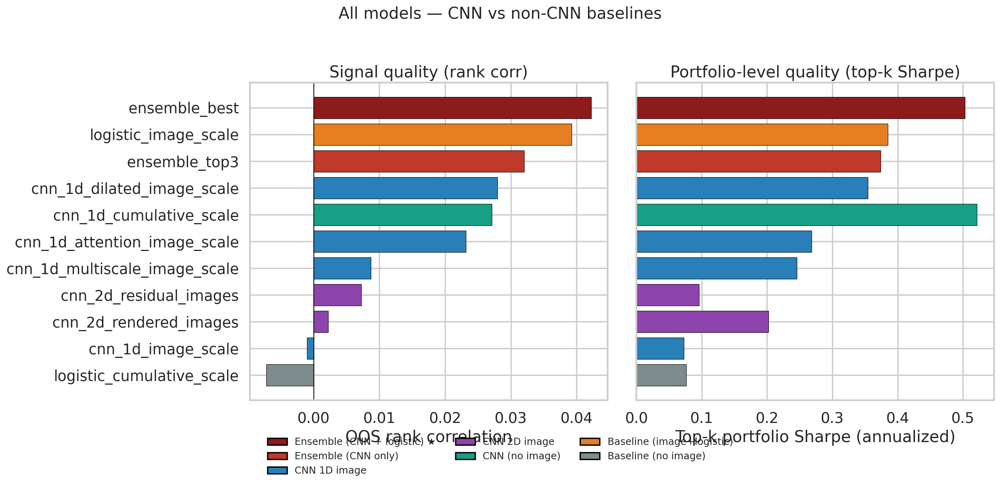
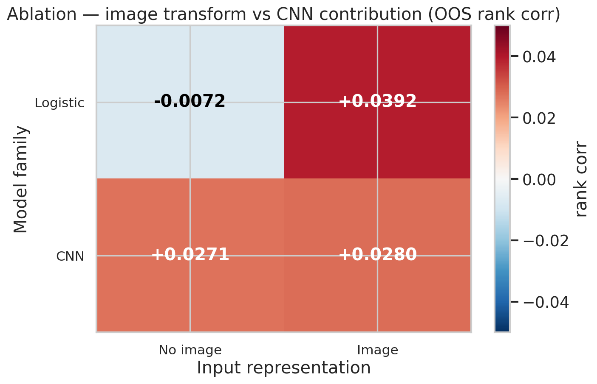
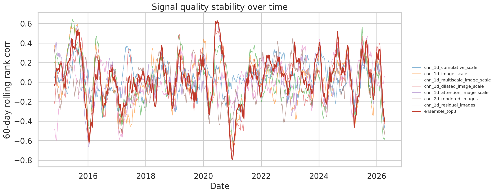
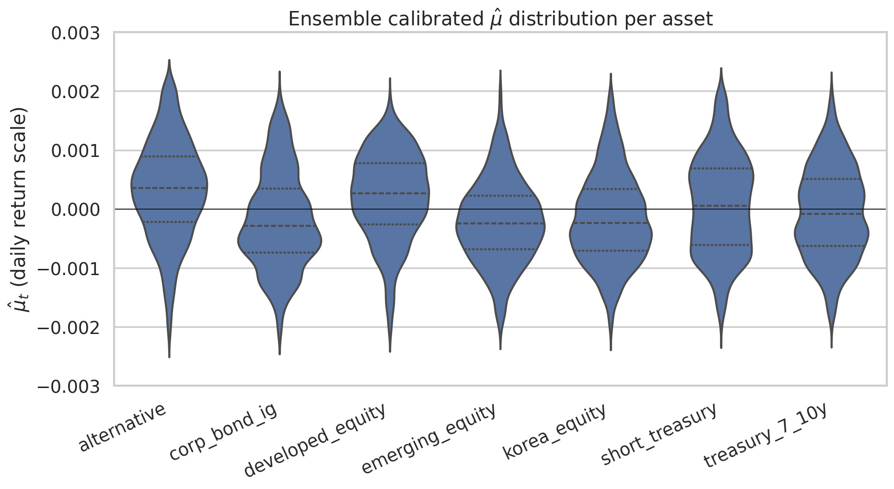
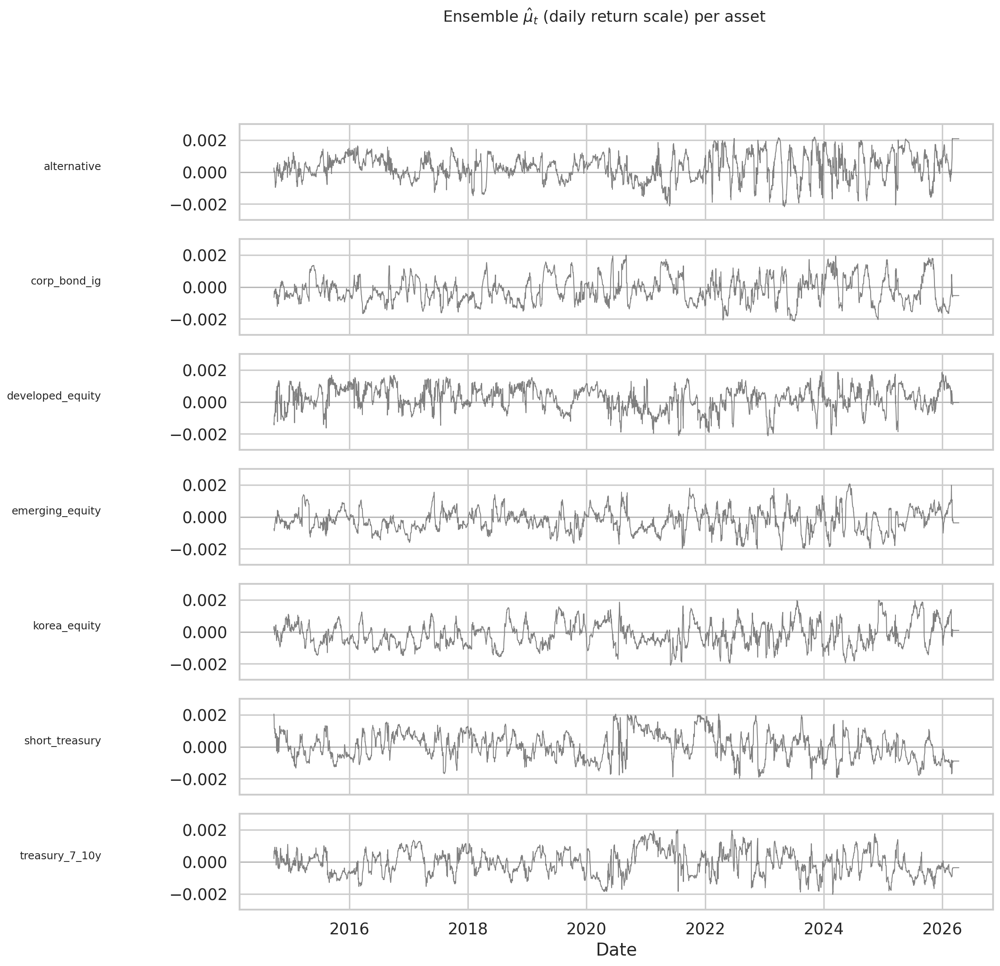
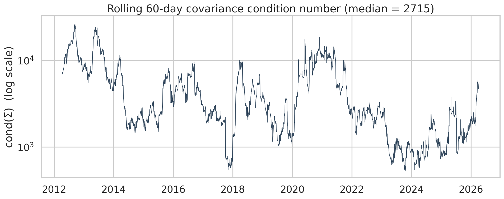
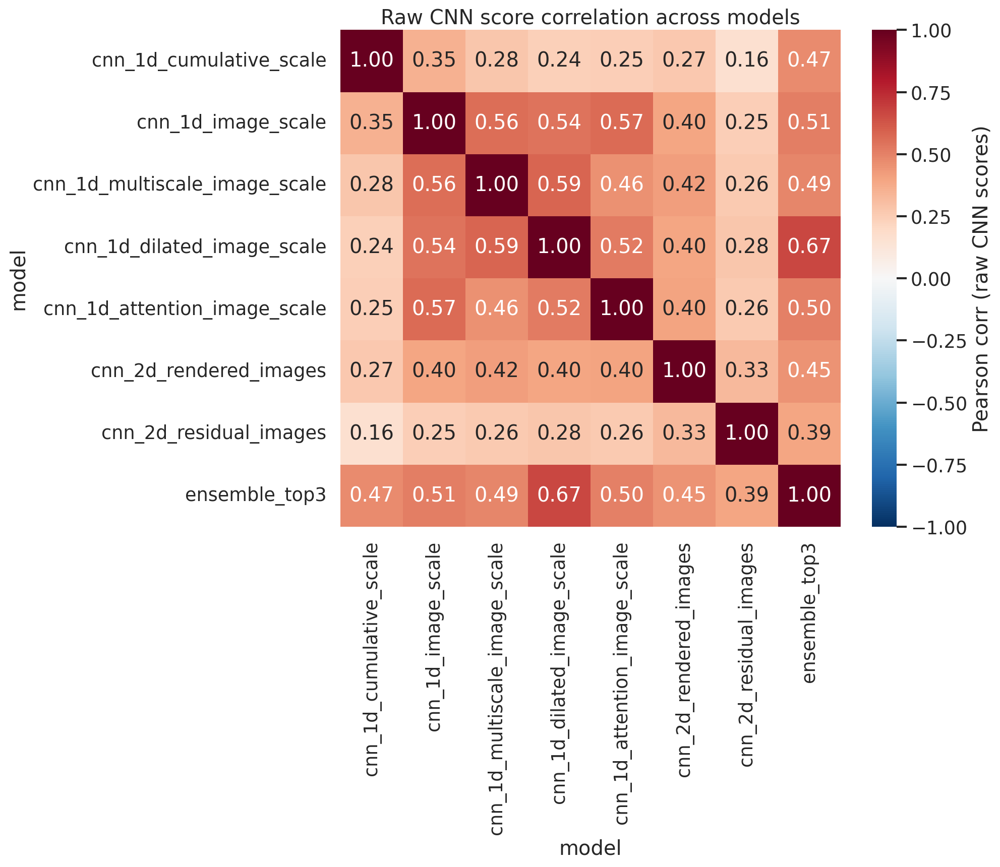
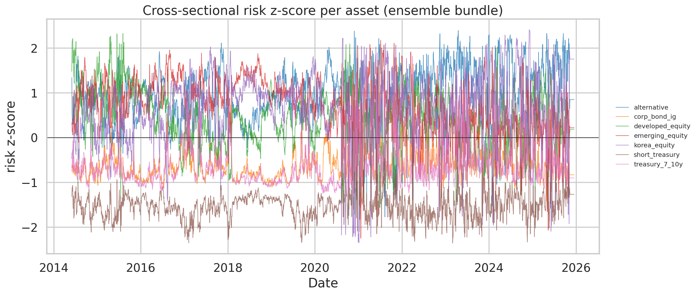
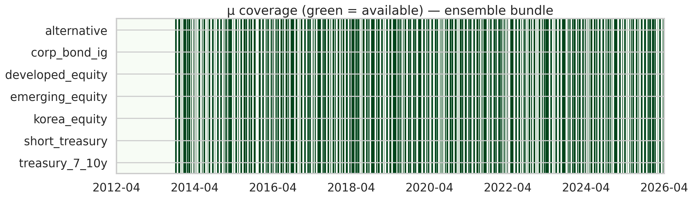

# CNN 시그널 → ODE 입력 — 팀 핸드오프 요약

> 이 문서는 **CNN 파트 결과물을 한 페이지로 브리핑**하는 용도입니다.
> 세부 스키마는 [README.md](README.md), 수치 sanity는 [qa_report.md](qa_report.md), 모델별 성능은 [comparison.md](comparison.md) 참고.

---

## TL;DR

- **7개 CNN 아키텍처** + **2종 앙상블** + **2종 non-CNN 베이스라인** (총 11 entries)을 walk-forward OOS로 평가
- ★ **`ensemble_best` (CNN + logistic 혼합)** 이 두 metric 모두 상위 → **다음 ODE 실험의 권장 default**
- ODE 입력 4종 (μ·Σ·risk·R) 모두 **daily 그리드로 정렬**되어 있고 **look-ahead leakage 없음**

### 핵심 숫자 (11 entries, non-CNN 베이스라인 포함)

| 지표 | Rank corr 1위 | Top-k Sharpe 1위 | 최약 베이스라인 |
|---|---|---|---|
| 모델 | ★ `ensemble_best` | `cnn_1d_cumulative_scale` | `logistic_cumulative_scale` |
| OOS rank corr | **0.0422** | 0.0271 | −0.0072 |
| Top-k Sharpe | 0.503 | **0.521** | 0.076 |

`ensemble_best` = `logistic_image_scale` + `cnn_1d_attention_image_scale` + `cnn_1d_cumulative_scale`, cross-sectional percentile-rank 평균. **단일 logistic_image_scale (0.039) 천장을 뚫고 두 metric에서 모두 top-3** — point-prediction(랭킹)과 portfolio-construction(Sharpe) 모두 상위권으로 통합된 첫 시그널.

레거시 CNN-only 앙상블 `ensemble_top3`: rank corr **0.0320**, top-k Sharpe **0.374** — 참고용으로 유지.

상세 비교표: [comparison_with_baselines.csv](comparison_with_baselines.csv) · 조합 탐색 결과: [ensemble_search_top.md](ensemble_search_top.md)

상세 비교표: [comparison_with_baselines.csv](comparison_with_baselines.csv)

---

## 1. 모델 비교 — CNN vs non-CNN 베이스라인 포함



11 entries를 walk-forward OOS(24 folds)에서 비교. 색은 family별:
- ★ **Ensemble (CNN + logistic)** — `ensemble_best` (권장 default)
- 🟥 **Ensemble (CNN only)** — 레거시 `ensemble_top3`
- 🟦 **CNN 1D image** · 🟪 **CNN 2D image** · 🟩 **CNN (no image)**
- 🟧 **Baseline (image+logistic)** · ⬜ **Baseline (no image)**

핵심 관찰:
- **Rank corr 1등은 `ensemble_best` (0.0422)** — logistic_image 단일(0.039) 천장을 뚫음
- **Top-k Sharpe 1등은 `cnn_1d_cumulative_scale` (0.52)**, `ensemble_best`가 0.503으로 근접 2위
- **2D CNN은 전 지표 완패**, `logistic_cumulative_scale`(완전 베이스)이 꼴찌 (-0.007)
- logistic_image가 거의 모든 상위 앙상블 조합에 포함됨 → **non-CNN 베이스라인이 CNN 다양화에 결정적 기여**

## 1-B. Ablation — "이미지 효과" vs "CNN 효과" 분리



2×2 ablation으로 요약:
- **이미지 변환 효과 (Logistic 기준)**: −0.0072 → +0.0392 = **+0.046 상승** 🚀
- **CNN 효과 (No-image 기준)**: −0.0072 → +0.0271 = **+0.034 상승** (비슷)
- **CNN이 image 위에 추가하는 효과**: +0.0392 → +0.0280 = **−0.011 하락** (오히려 감소)

→ 이 데이터셋에서 **대부분의 lift는 "이미지 변환(Jiang-style)" 자체에서 나옴**. CNN은 입력 종류에 robust한 모델(이미지든 아니든 비슷)이라는 점에 값어치가 있고, rank corr만으로는 로지스틱 대비 우위 없음.

Portfolio-level에서는 CNN이 로지스틱을 앞섬 — 점예측 품질과 포트폴리오 구성 품질이 분리되는 케이스.

---

## 2. 시그널 품질의 시간 안정성



- 60일 rolling rank correlation — **양수 구간 비율**로 시그널이 언제 잘 먹히는지 확인
- 굵은 빨간선 = 앙상블, 나머지는 단일 모델
- 2020 팬데믹 구간 등 regime shift에서 모든 모델이 잠깐 음수 — 앙상블은 빠르게 회복

---

## 3. μ 분포 — 단위·스케일 sanity



- 모든 자산 μ의 하루치 스케일이 **±0.003 이내** (논문의 daily log return 규모와 일관)
- 중앙값이 0 근처 → 체계적 bias 없음
- 채권류(`short_treasury`, `corp_bond_ig`) variance 더 좁음 — 실제 수익률 변동성과 일치



- 7개 자산 각각의 μ_hat_daily 시계열 — 특정 자산에 영구 drift가 없는지 확인용

---

## 4. 공분산 Σ — 수치 안정성



- 60일 rolling sample covariance의 조건수 (log scale)
- **중간값 ≈ 2,715** — 권장 임계치(10³~10⁴) 범위
- Spike 시점: 2013년 테이퍼, 2018/2020 변동성 급등 구간 — ODE solver에서 이 구간은 shrinkage 권장

---

## 5. 앙상블 diversification



- Raw CNN score 간 Pearson 상관 — **낮을수록 앙상블 효과 큼**
- `cnn_2d_residual_images`가 1D 모델들과 **0.25~0.28 상관** → 만약 top-3 기준을 바꾸면 다양성 기여 가능
- 현재 top-3은 1D 계열로 상관 0.46~0.59 (중간 diversification)
- 앙상블 자체는 top-3과 0.48~0.83으로 자연스럽게 합성

---

## 6. Risk 신호



- 교차단면 z-score → 매일 자산 간 상대 위험도 (합 ≈ 0, std ≈ 1)
- ODE에서 time-varying γ(t)를 만들고 싶을 때 **자산별 weighting 힌트**로 쓸 수 있음

---

## 7. 데이터 커버리지



- **2014-09-24 ~ 2026-04-13** 전 기간 모든 자산 동시 유효
- 앞 구간(2012~2014)은 Σ warmup만 존재 (μ 미계산) — ODE 실험에선 2014-09-24 이후 사용 권장

---

## 8. 다음 스프린트 Quickstart`

```python
import pandas as pd
from pathlib import Path

ROOT = Path("ode_inputs_cnn/ensemble_best")   # 권장 default; 또는 ensemble_top3 / 특정 모델 dir

bundle = pd.read_csv(ROOT / "ode_bundle.csv", parse_dates=["date"])
returns = pd.read_csv("ode_inputs_cnn/returns_daily.csv", parse_dates=["date"])

ASSETS = ["alternative", "corp_bond_ig", "developed_equity", "emerging_equity",
          "korea_equity", "short_treasury", "treasury_7_10y"]

# μ(t): shape = (T, 7)
mu = bundle[[f"{a}_mu" for a in ASSETS]].values

# Σ(t): 매 날짜마다 7x7 매트릭스 (sigma_ii + 모든 cov 쌍)
# risk_score: (T, 7)
risk = bundle[[f"{a}_risk" for a in ASSETS]].values
```

**leakage 보증**: μ calibration은 expanding 방식, Σ는 t 시점까지의 60일 window만 사용.

---

## 추천 실험 시퀀스

1. **Smoke test**: `ensemble_best`로 Euler ODE 한번 돌려서 weight trajectory 만들기
2. **Ablation 1**: `ensemble_best` vs `ensemble_top3` vs 단일 best → mixed 앙상블 값어치 검증
3. **Ablation 2**: μ 시그널 대신 단순 모멘텀 baseline → CNN이 실제 lift 주는지 정량화
4. **Sensitivity**: 같은 ODE에 `risk_score` 기반 γ(t) 투입 vs γ_const

---

## 경고 / 한계

- **OOS rank corr 0.04 수준은 statistically 작은 신호.** 단일 점 예측보다는 앙상블·시간평균·포트폴리오 관점에서 활용 권장
- **CNN만의 앙상블은 rank corr에서 logistic_image를 이기지 못함** (0.032 < 0.039). `ensemble_best`로 logistic을 포함시켜야 천장 돌파 (0.042)
- **2D CNN은 현 데이터셋에서 underperform**. 향후 데이터 확대(long lookback OHLCV) 없이 2D 추가 투자는 ROI 낮음
- **γ(t) 시변 위험회피 신호는 이번 CNN 파트에 포함 안 됨** — ODE 스프린트에서 추가 실험 대상

## 발표 시 방어 framing (권장)

> "**이미지 변환 자체가 가장 큰 lift**를 제공하고(rank corr −0.007 → +0.039), CNN은 그 위에 **portfolio-level 개선**을 추가한다. 하지만 CNN-only 앙상블로는 단일 logistic_image를 rank corr에서 이기지 못한다 — **mixed-family 앙상블(`ensemble_best`)이 필요**했다. 이 mixed 앙상블은 logistic_image를 포함한 3개 멤버의 cross-sectional rank 평균으로, rank corr **0.042**와 top-k Sharpe **0.503**을 동시에 달성. 즉 'CNN이 logistic을 압도'가 아니라 '**두 family가 서로 보완**'이 이번 실험의 empirical 결론이다."
